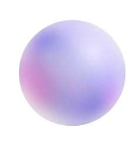

# Venesa

<p align="center">
  
</p>

<p align="center">
  <strong>An autonomous, programmable AI platform for Windows that transforms natural language into executable system workflows.</strong>
</p>
<p align="center">
  <em>Windows only. MIT licensed. Entirely local except for the LLM and speech APIs you configure.</em>
</p>

<p align="center">
  
  
  
  
  
  
  
</p>

---

## What is Venesa?

Venesa is a desktop AI assistant for Windows built on a fundamentally different premise than most voice assistants or chatbots. It does not treat the AI as a conversational interface - it treats the AI as an **execution engine**. When you ask Venesa to do something, the language model formulates a structured plan and the platform executes it as real system operations: launching apps, managing files, controlling settings, running scripts, and more.

The result is an assistant that can take a complex, loosely-worded request and carry it out end-to-end - autonomously, silently, or with confirmation steps where appropriate - without you needing to specify every instruction manually.

You interact with Venesa by voice (wake word or push-to-talk) or through the text interface. The assistant remembers your preferences and context across sessions, so it gets more useful the more you use it.

---

## What Venesa Can Do

### System Automation

Venesa ships with a full set of built-in capabilities covering common Windows operations:

- Launch and close applications
- Control system volume, display brightness, and power state
- Manage windows (minimize, snap, focus, close all)
- Read and write the clipboard
- Search, open, move, copy, and delete files
- Run sandboxed PowerShell scripts
- Take screenshots
- Open URLs and perform Google searches
- Set reminders

### Multi-Step Workflows

Where Venesa stands apart is in orchestration. Rather than executing one command at a time, it can decompose a single request into a serialized sequence of steps - a plan - and execute them in order, passing results between steps automatically.

Examples of what this enables:

> "Copy everything in my clipboard and search Google for it."

> "Close all open apps, set the volume to zero, and lock the screen."

> "Take a screenshot of my desktop, save it to my Documents folder, and open it in Paint."

> "Find all PDF files modified in the last week and list them out."

Each step in a plan carries a visibility marker - it can run silently in the background, announce its result, or pause and ask for your confirmation before proceeding. This gives you fine-grained control over how automated the assistant behaves for any given action.

### Voice Interaction

Venesa runs a continuous, offline wake-word listener using the Vosk speech model. When the wake phrase is detected, it captures your speech, transcribes it via ElevenLabs Scribe, sends it through the reasoning engine, and responds through a floating voice overlay - speaking the response aloud with ElevenLabs Flash v2.5 synthesis. The voice overlay is always-on-top and unobtrusive.

The wake word, voice style, and speech behavior are all configurable.

### Persistent Memory

Every interaction can write to named memory buckets - preferences, aliases, reminders, and conversation history - that are injected into the AI's context on every subsequent query. Venesa remembers your name, your preferences, custom command aliases, and anything else you tell it to keep. There is no cloud sync; everything is stored locally in `%USERPROFILE%\.venesa\memory.json`.

### Dynamic Interfaces

When a query warrants structured output - a list of running processes, disk usage, network adapters, installed apps - the AI renders it as a formatted UI element directly in the interface: tables, key-value grids, card lists, or command lists. The layout is determined by the response content, not hardcoded.

---

## Flexibility: The Capability System

Venesa's built-in features are only the starting point. The platform is designed to be extended with **capabilities** - single JavaScript files that give the AI a new skill. Once a capability is installed, it becomes part of the AI's tool chain and can be invoked by name in any query or as a step in a plan.

### How Capabilities Work

A capability is a CommonJS module that exports an object describing a skill: its name, a description that gets injected into the AI's system prompt so the model knows when to use it, a Zod schema for parameter validation, and an async handler that performs the actual work.

When the AI decides to use a capability, the platform validates the parameters against the schema and calls the handler. Errors are isolated - a broken capability cannot take down the rest of the system.

Capabilities can return data for the AI to reason about further, trigger UI renders, write to memory, perform system actions, or do a combination of all of these.

### Community Capabilities

The [venesa-capabilities](https://github.com/mianjunaid1223/venesa-capabilities) repository is the official registry of community-built capabilities. It currently includes skills for:

- Checking disk usage, network adapters, and system info
- Listing running processes and installed applications
- Fetching weather forecasts
- Searching YouTube and Google
- Managing persistent notes
- Retrieving saved WiFi credentials
- Cleaning up temporary files and junk

...and more. The registry is growing.

**Installing community capabilities** requires no downloads or file management. From inside Venesa:

1. Open **Settings → Skills & Capabilities**
2. Select the **Community** tab
3. Browse the live registry, then click **Install** on any capability
4. It's ready to use now.

Installed capabilities are indistinguishable from built-in core skills at runtime.

---

## Getting Started

**Requirements:**

- Windows 10 or 11 (x64)
- Node.js v18.0.0 or higher
- pnpm (`npm install -g pnpm`)
- A [Google AI Studio](https://aistudio.google.com/) API key (Gemini)
- An [ElevenLabs](https://elevenlabs.io/) API key (STT + TTS)

**Install and run:**

```bash
git clone https://github.com/mianjunaid1223/Venesa.git
cd Venesa
pnpm install
pnpm start
```

The first launch opens a setup wizard where you configure your API keys and preferences. No manual `.env` editing required, though you can also create one:

```env
GEMINI_API_KEY=your_key
ELEVENLABS_API_KEY=your_key
```

Append `_1`, `_2`, etc. to any key to enable automatic round-robin rotation when rate limits are hit.

For verbose logging:

```bash
pnpm dev
```

To build a distributable installer:

```bash
pnpm build
```

---

## Contributing

There are two ways to contribute to Venesa:

### 1. Contribute to the Platform

If you want to improve the core assistant - fix bugs, improve orchestration, extend the speech pipeline, add new built-in capabilities, or improve the UI - open a pull request on this repository.

Before contributing, read [ARCHITECTURE.md](ARCHITECTURE.md) to understand the execution pipeline and module responsibilities, and [standards.md](standards.md) for code conventions, capability schema rules, and security requirements. All contributions must conform to the unified protocol standard described there.

### 2. Publish a Community Capability

If you want to give Venesa a new skill without modifying the core platform, build and submit a capability to the [venesa-capabilities](https://github.com/mianjunaid1223/venesa-capabilities) repository. One file. No dependencies on the main project required. Venesa handles dependencies (which you just provide in its manifest) and versions automatically.

A capability is a single `.js` file dropped into the `/capabilities/` folder of that repository. Once merged, it becomes available to all Venesa users via the in-app community browser.

**Minimal example:**

```js
const { z } = require("zod");

module.exports = {
  name: "myCapability",
  description:
    "Describe what this does - the AI reads this to decide when to use it.",
  returnType: "action", // data | action | ui | memory | hybrid
  marker: "announce", // silently | announce | confirm
  schema: z.object({
    input: z.string().describe("The input value"),
  }),
  handler: async ({ input }) => {
    return { success: true, result: `Processed: ${input}` };
  },
};
```

Full specification - schema options, return types, lifecycle hooks, UI rendering hints - is documented in the [venesa-capabilities](https://github.com/mianjunaid1223/venesa-capabilities) repository. The same rules apply whether a capability is built-in or community-contributed.

---

## Documentation

| Document                                                                     | Contents                                                                                                                              |
| ---------------------------------------------------------------------------- | ------------------------------------------------------------------------------------------------------------------------------------- |
| [ARCHITECTURE.md](ARCHITECTURE.md)                                           | Full internal architecture: pipeline diagrams, module responsibilities, IPC design, memory system, speech stack, capability lifecycle |
| [standards.md](standards.md)                                                 | Capability schema specification, code conventions, security requirements, governance rules                                            |
| [venesa-capabilities](https://github.com/mianjunaid1223/venesa-capabilities) | Community capability registry and development guide                                                                                   |

---

## License

MIT. See [LICENSE](LICENSE) for details.

---

<p align="center">
  Developed by <a href="https://github.com/mianjunaid1223">Mian Junaid</a>
</p>
